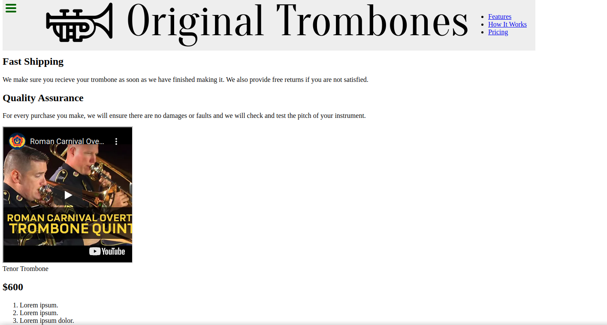

# Code Review

> This is an excercise for the microverse technical curriculum.

## Built With

- HTML
- CSS

## Live Demo

[Live Demo Link](leboroz.github.io/Project-review)

## Authors

👤 **Leonardo Albornoz**

- GitHub: [@Leboroz](https://github.com/Leboroz)
- Twitter: [@Leboroz](https://twitter.com/Leboroz)
- LinkedIn: [Leonardo Albornoz](https://linkedin.com/in/linkedinhandle)

## 🤝 Contributing

Contributions, issues, and feature requests are welcome!

Feel free to check the [issues page](https://github.com/Leboroz/Project-review/issues).

## Show your support

Give a ⭐️ if you like this project!

## Acknowledgments

- Hat tip to anyone whose code was used
- Inspiration
- etc

## 📝 License

This project is [MIT](./MIT.md) licensed.
